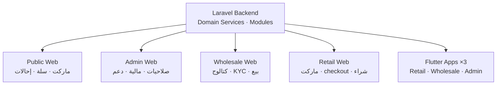
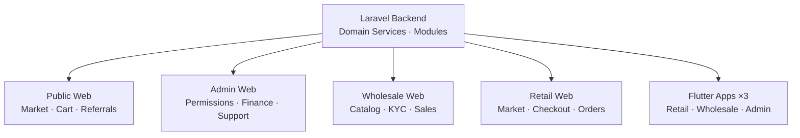

<div align="center">

# طلبيات · Talabyaat

### منصة B2B للتجارة بين الجملة والتجزئة  
### B2B Marketplace — Wholesale meets Retail

<br>

[](https://www.talabyaat.com)
[](https://retail.talabyaat.com)
[](https://wholesale.talabyaat.com)
[](https://github.com/nour0x/talabyaat-case-study)

<br>

[](https://laravel.com)
[](https://flutter.dev)
[](https://php.net)
[](https://www.talabyaat.com)

<br><br>

### 🌐 Language · اللغة

**[🇪🇬 العربية](#ar)** &nbsp;·&nbsp; **[🇬🇧 English](#en)**

</div>

---

<a id="links"></a>

## 🔗 روابط المشروع · Project Links

<table align="center">
<tr>
<td align="center" width="25%">
<strong>🌐 المنصة الرئيسية</strong><br>
<a href="https://www.talabyaat.com"><code>talabyaat.com</code></a>
</td>
<td align="center" width="25%">
<strong>🏪 تجار التجزئة</strong><br>
<a href="https://retail.talabyaat.com"><code>retail.talabyaat.com</code></a>
</td>
<td align="center" width="25%">
<strong>📦 تجار الجملة</strong><br>
<a href="https://wholesale.talabyaat.com"><code>wholesale.talabyaat.com</code></a>
</td>
<td align="center" width="25%">
<strong>📄 Case Study</strong><br>
<a href="https://github.com/nour0x/talabyaat-case-study"><code>github.com/nour0x/talabyaat-case-study</code></a>
</td>
</tr>
</table>

---

<a id="ar"></a>

## 🇪🇬 العربية

### نظرة عامة

**طلبيات (Talabyaat)** منصة تجارة إلكترونية B2B مصممة للسوق المحلي: تاجر **تجزئة** يشتري من تاجر **جملة** داخل سوق موحّد. المنصة تدير العمولة، المحافظ، الدفع، التقييمات، الشات، والدعم الحي — من باكند واحد يخدم **4 قنوات ويب** و**3 تطبيقات Flutter**.

<table>
<tr><td>🎯 <strong>النوع</strong></td><td>Marketplace B2B — جملة ↔ تجزئة</td></tr>
<tr><td>🌐 <strong>الإنتاج</strong></td><td><a href="https://www.talabyaat.com">talabyaat.com</a></td></tr>
<tr><td>📱 <strong>التطبيقات</strong></td><td>Retail · Wholesale · Admin (Android / Flutter)</td></tr>
<tr><td>⚙️ <strong>الباكند</strong></td><td>Laravel 13 · PHP 8.4 · Sanctum · Reverb</td></tr>
<tr><td>✅ <strong>الحالة</strong></td><td>Production-ready · V1 مقفول للإطلاق</td></tr>
</table>

---

### التحدي

في أسواق B2B المحلية، التجارة بين الجملة والتجزئة غالباً تتم عبر واتساب واتصالات غير منظمة — بدون تتبع للطلبات، لا محفظة مركزية، لا KYC، ولا أمان على مستوى المدفوعات.

**الهدف:** بناء منصة production-grade تربط الطرفين وتدير دورة الطلب كاملة من السلة إلى التسليم.

---

### الحل — نظام متعدد القنوات



| القناة | الرابط | الجمهور |
|:--|:--|:--|
| **Public** | [talabyaat.com](https://www.talabyaat.com) | زوار — ماركت عام، سلة، إحالات |
| **Retail** | [retail.talabyaat.com](https://retail.talabyaat.com) | تجار التجزئة |
| **Wholesale** | [wholesale.talabyaat.com](https://wholesale.talabyaat.com) | تجار الجملة |
| **Admin** | مسار مخفي | موظفون — صلاحيات، موافقات، مالية |
| **API** | `/api/v1` | التطبيقات — REST + Real-time |

---

### التطبيقات

| التطبيق | Package ID | الإصدار | الهوية |
|:--|:--|:--|:--|
| **Retail** — طلبيات موردين | `com.mudiridigi.TalabyaatRetail` | 1.0.0+3 | سوق مشتري دافئ |
| **Wholesale** — طلبيات موردين | `com.mudiridigi.TalabyaatWholesale` | 1.0.0+1 | مكتب تاجر |
| **Admin** — لوحة تحكم | `com.mudiridigi.TalabyaatAdmin` | V1 | حبر غامق + رمل |

> Bootstrap ديناميكي · Firebase Push · SSL Pinning · Biometric Auth · R8 Obfuscation

---

### الميزات الرئيسية

<details open>
<summary><strong>🏪 للتجار</strong></summary>

- تسجيل متعدد الخطوات + OTP (SMS / WhatsApp)
- KYC ومستندات + صورة المحل
- كتالوج منتجات (variants · price tiers · pack units)
- سلة ذكية + wishlist
- محفظة + EasyCash + إثبات تحويل
- شات real-time + تقييمات + برنامج إحالات

</details>

<details open>
<summary><strong>🛡️ للإدارة</strong></summary>

- لوحة مخفية المسار — ليست `/admin`
- صلاحيات granular + موافقات مزدوجة
- Impersonate · دعم حي · تقارير وتصدير
- إدارة موديولز · صيانة · Force Update

</details>

---

### المعمارية

```
HTTP (Routes · Controllers · Middleware)
        ↓
Domain Services  ← Source of Truth
        ↓
Models · Settings · Gateways
        ↓
Database · R2 · Reverb · FCM · SMS
```

- **14 Bounded Contexts** — Foundation, Identity, Accounts, Catalog, Cart, Orders, Finance, Chat, Support, Notify, Growth, Referrals, Reports, Ratings
- **Module Kernel** — تشغيل/إيقاف فيتشرز بدون refactor
- **Controllers رفيعة** — كل المنطق التجاري في Domain Services

---

### مقاييس المشروع

| المقياس | القيمة |
|:--|--:|
| Bounded Contexts | 14 |
| PHP source files | ~455 |
| Dart files (3 apps) | ~267 |
| Database migrations | 71 |
| Test files | 111+ |
| Product channels | 4 web + 1 API + 3 mobile |

---

### Technology Stack

| Backend | Mobile | DevOps |
|:--|:--|:--|
| Laravel 13 · PHP 8.4 | Flutter 3.44 · Dart 3.12 | GitHub → VPS |
| Sanctum · Reverb | Firebase Messaging | Post-deploy smoke |
| Tailwind CSS 4 · Vite | SSL Pinning · Secure Storage | Play Store AAB |
| Cloudflare R2 · FCM | local_auth · geolocator | k6 load testing |

---

<div align="center">

**[⬆️ العودة للأعلى](#links)** &nbsp;·&nbsp; **[🇬🇧 English](#en)**

</div>

---

<a id="en"></a>

## 🇬🇧 English

### Overview

**Talabyaat (طلبيات)** is a B2B e-commerce platform built for local wholesale–retail trade: **retail merchants** buy from **wholesale merchants** inside a unified marketplace. The platform handles commissions, wallets, payments, ratings, live chat, and support — powered by a single backend serving **4 web channels** and **3 Flutter apps**.

<table>
<tr><td>🎯 <strong>Type</strong></td><td>B2B Marketplace — Wholesale ↔ Retail</td></tr>
<tr><td>🌐 <strong>Production</strong></td><td><a href="https://www.talabyaat.com">talabyaat.com</a></td></tr>
<tr><td>📱 <strong>Apps</strong></td><td>Retail · Wholesale · Admin (Android / Flutter)</td></tr>
<tr><td>⚙️ <strong>Backend</strong></td><td>Laravel 13 · PHP 8.4 · Sanctum · Reverb</td></tr>
<tr><td>✅ <strong>Status</strong></td><td>Production-ready · V1 locked for launch</td></tr>
</table>

---

### The Challenge

In local B2B markets, wholesale–retail trade often happens over unstructured WhatsApp chats — with no order tracking, no central wallet, no KYC, and no payment-grade security.

**Goal:** Build a production-grade platform that connects both sides and manages the full order lifecycle from cart to delivery.

---

### The Solution — Multi-Channel System



| Channel | Link | Audience |
|:--|:--|:--|
| **Public** | [talabyaat.com](https://www.talabyaat.com) | Visitors — public market, cart, referrals |
| **Retail** | [retail.talabyaat.com](https://retail.talabyaat.com) | Retail merchants |
| **Wholesale** | [wholesale.talabyaat.com](https://wholesale.talabyaat.com) | Wholesale merchants |
| **Admin** | Hidden route | Staff — permissions, approvals, finance |
| **API** | `/api/v1` | Mobile apps — REST + Real-time |

---

### Mobile Apps

| App | Package ID | Version | Identity |
|:--|:--|:--|:--|
| **Retail** | `com.mudiridigi.TalabyaatRetail` | 1.0.0+3 | Warm buyer marketplace |
| **Wholesale** | `com.mudiridigi.TalabyaatWholesale` | 1.0.0+1 | Merchant desk |
| **Admin** | `com.mudiridigi.TalabyaatAdmin` | V1 | Dark ink + sand |

> Dynamic bootstrap · Firebase Push · SSL Pinning · Biometric Auth · R8 Obfuscation

---

### Key Features

<details open>
<summary><strong>🏪 For Merchants</strong></summary>

- Multi-step registration + OTP (SMS / WhatsApp)
- KYC documents + shop photo verification
- Product catalog (variants · price tiers · pack units)
- Smart cart + wishlist
- Internal wallet + EasyCash + transfer proof
- Real-time chat + ratings + referral program

</details>

<details open>
<summary><strong>🛡️ For Administration</strong></summary>

- Hidden admin route — not `/admin`
- Granular permissions + dual approvals
- Impersonate · live support · reports & export
- Module management · maintenance · force update

</details>

---

### Architecture

```
HTTP (Routes · Controllers · Middleware)
        ↓
Domain Services  ← Source of Truth
        ↓
Models · Settings · Gateways
        ↓
Database · R2 · Reverb · FCM · SMS
```

- **14 Bounded Contexts** — Foundation, Identity, Accounts, Catalog, Cart, Orders, Finance, Chat, Support, Notify, Growth, Referrals, Reports, Ratings
- **Module Kernel** — enable/disable features without refactoring
- **Thin Controllers** — all business logic lives in Domain Services

---

### Project Metrics

| Metric | Value |
|:--|--:|
| Bounded Contexts | 14 |
| PHP source files | ~455 |
| Dart files (3 apps) | ~267 |
| Database migrations | 71 |
| Test files | 111+ |
| Product channels | 4 web + 1 API + 3 mobile |

---

### Technology Stack

| Backend | Mobile | DevOps |
|:--|:--|:--|
| Laravel 13 · PHP 8.4 | Flutter 3.44 · Dart 3.12 | GitHub → VPS |
| Sanctum · Reverb | Firebase Messaging | Post-deploy smoke |
| Tailwind CSS 4 · Vite | SSL Pinning · Secure Storage | Play Store AAB |
| Cloudflare R2 · FCM | local_auth · geolocator | k6 load testing |

---

<div align="center">

**[⬆️ Back to top](#links)** &nbsp;·&nbsp; **[🇪🇬 العربية](#ar)**

</div>

---

<div align="center">

## 🏢 Developed by · تطوير

<br>

### [موديري ديجي · Mudiri Digi](https://mudiridigi.com)

*نظام واضح لمتجرك أو عيادتك أو موقع شركتك — بدون فوضى ملفات*  
*Clear systems for your store, clinic, or company website*

<br>

<table>
<tr>
<td align="center">
<strong>🌐 الموقع · Website</strong><br>
<a href="https://mudiridigi.com">mudiridigi.com</a>
</td>
<td align="center">
<strong>🛒 المتجر · Store</strong><br>
<a href="https://mudiridigi.shop">mudiridigi.shop</a>
</td>
<td align="center">
<strong>📧 البريد · Email</strong><br>
<a href="mailto:dev.nour.m@gmail.com">dev.nour.m@gmail.com</a>
</td>
<td align="center">
<strong>📞 الهاتف · Phone</strong><br>
<a href="tel:+201552114232">+20 155 211 4232</a>
</td>
</tr>
<tr>
<td align="center" colspan="2">
<strong>💬 واتساب · WhatsApp</strong><br>
<a href="https://wa.me/201552114232">wa.me/201552114232</a>
</td>
<td align="center" colspan="2">
<strong>📄 Case Study Repo</strong><br>
<a href="https://github.com/nour0x/talabyaat-case-study">github.com/nour0x/talabyaat-case-study</a>
</td>
</tr>
</table>

<br>

[](https://mudiridigi.com)
[](https://mudiridigi.shop)
[](mailto:dev.nour.m@gmail.com)
[](https://wa.me/201552114232)

<br><br>

---

**طلبيات · Talabyaat** — B2B Marketplace · Wholesale meets Retail

*© Mudiri Digi · All rights reserved*

</div>
