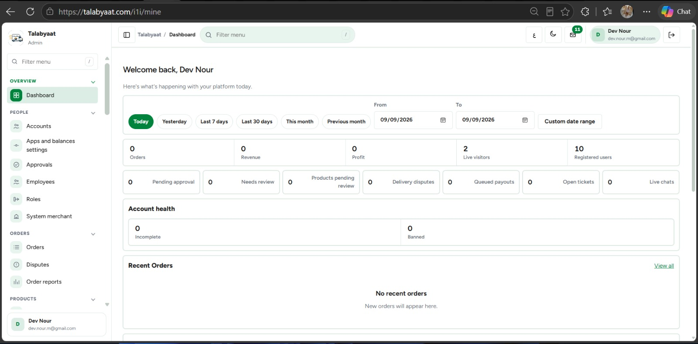
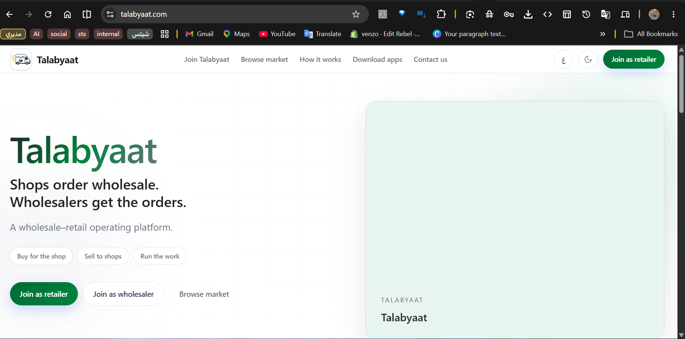
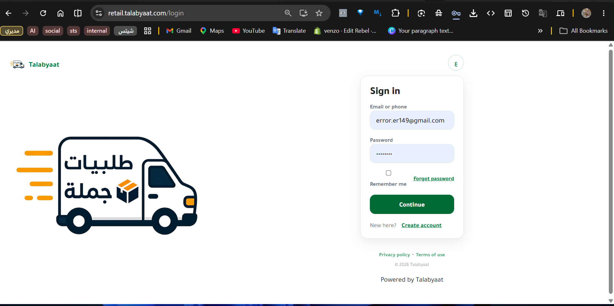
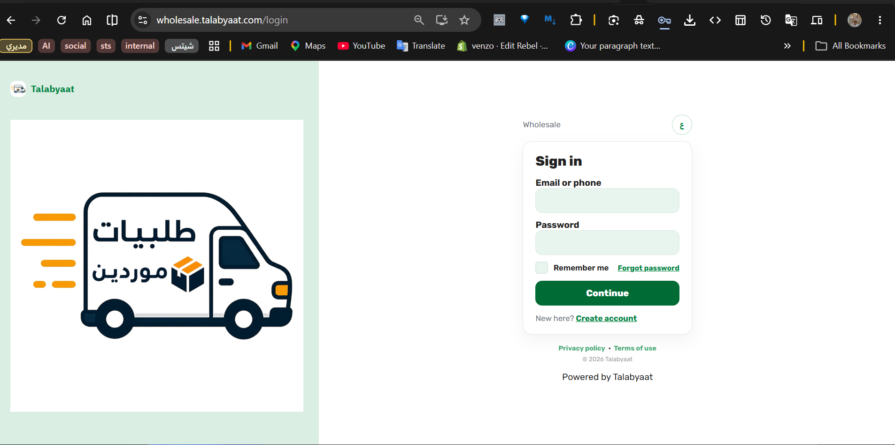

<div align="center">

# Talabyaat

### B2B E-commerce Platform

**Wholesale Commerce · Business Platform · Mobile Applications**

<br>


</div>

---

## Overview

**Talabyaat** is a B2B e-commerce platform designed to help shops and businesses discover wholesale products, compare available offers, and manage their purchasing activity through a unified digital platform.

The platform connects businesses with suppliers and wholesalers while supporting different commercial workflows across web and mobile.

---
## Product Preview

<p align="center">
  
  
  
  
</p>

<p align="center">
  <i>Selected interface previews from the Talabyaat platform</i>
</p>

---
## Platform Highlights

<table>
<tr>
<td width="50%" valign="top">

### 🛒 Wholesale Commerce

A dedicated B2B shopping experience built around wholesale pricing, quantities, and business purchasing workflows.

</td>
<td width="50%" valign="top">

### 👥 Multi-Role Platform

Different workflows for businesses, suppliers, wholesalers, and administrators, each with its own permissions and responsibilities.

</td>
</tr>

<tr>
<td width="50%" valign="top">

### 📱 Mobile Applications

Flutter-based mobile experiences connected to the same backend and business logic through REST APIs.

</td>
<td width="50%" valign="top">

### 🔔 Real-Time Notifications

Firebase Cloud Messaging integration for delivering important order and platform notifications to users.

</td>
</tr>
</table>

---

## Technical Architecture

```text
┌──────────────────────────────────────────────────────┐
│                   Talabyaat Platform                 │
├───────────────────────┬──────────────────────────────┤
│       Web Apps        │       Mobile Apps            │
│  Wholesale · Retail   │          Flutter             │
├───────────────────────┴──────────────────────────────┤
│                    REST APIs                          │
├──────────────────────────────────────────────────────┤
│                  Laravel Backend                      │
│ Authentication · Business Logic · Orders · Users    │
├──────────────────────────────────────────────────────┤
│                     MySQL                            │
└──────────────────────────────────────────────────────┘
```

---

## Core Technology

<p align="center">


</p>

<p align="center">


</p>

---

## The Business Goal

The goal was to transform traditional wholesale purchasing into a more organized digital experience.

The platform was designed to help businesses:

* Discover wholesale products
* View prices and required quantities
* Explore offers from multiple suppliers
* Create and manage purchase orders
* Follow order status
* Access their purchasing experience from web and mobile

---

## What I Built

### Web Platform

* Product catalog and categories
* Wholesale product browsing
* Search and discovery
* Cart and order workflows
* Business-focused purchasing experience
* Responsive interfaces

### Administration

* Product management
* Order management
* User and role management
* Business workflows
* Operational controls
* Platform administration

### Mobile Applications

* Flutter mobile applications
* Secure API communication
* Authentication
* Product browsing
* Cart and ordering
* Push notifications

### Backend

* Laravel application
* MySQL database
* REST APIs
* Authentication and authorization
* Background jobs
* Notification services
* Production deployment

---

## Technology Stack

| Layer          | Technologies                        |
| -------------- | ----------------------------------- |
| Backend        | Laravel, PHP                        |
| Database       | MySQL                               |
| Mobile         | Flutter, Dart                       |
| APIs           | REST API                            |
| Notifications  | Firebase Cloud Messaging            |
| Infrastructure | Linux, Git, Cloudflare              |
| Security       | Authentication, Roles & Permissions |

---

## Architecture

```text
                    ┌─────────────────────┐
                    │     Web Platform    │
                    └──────────┬──────────┘
                               │
                               │
                    ┌──────────▼──────────┐
                    │      REST APIs      │
                    └──────────┬──────────┘
                               │
              ┌────────────────┼────────────────┐
              │                │                │
      ┌───────▼───────┐ ┌──────▼──────┐ ┌──────▼──────┐
      │    Flutter    │ │   Laravel   │ │    Admin    │
      │     Apps      │ │   Backend   │ │   System    │
      └───────────────┘ └──────┬──────┘ └─────────────┘
                               │
                         ┌─────▼─────┐
                         │   MySQL   │
                         └───────────┘
```

---

## My Role

I worked on the technical architecture and development of the platform, including:

* Backend development
* API development
* E-commerce workflows
* Database design
* Mobile application development
* Admin systems
* Notifications
* Authentication and permissions
* Production deployment

---

## Key Challenges

### Multi-role Business Logic

The platform needed to support different users and business workflows without making the system difficult to maintain.

### Wholesale Purchasing

Wholesale products often depend on pricing and minimum quantities, which required business rules different from a standard consumer store.

### Web & Mobile Consistency

The web platform and mobile applications needed to work with the same backend and business logic.

### Production Reliability

The application required secure deployment, background processing, notifications, and reliable communication between the mobile applications and backend.

---

## Result

The result is a complete B2B commerce platform that brings wholesale products, businesses, suppliers, orders, administration, and mobile access together in one system.

The platform is designed to make wholesale purchasing more organized, accessible, and efficient.

---

## Project Privacy

This is a **private client project**.

The production source code, business data, credentials, and internal implementation details are not publicly available due to client confidentiality.

This repository is a **public case study only**.

---

<div align="center">

### Talabyaat

**B2B E-commerce • Laravel • Flutter • REST APIs**

</div>
